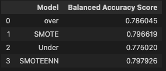
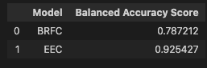

# Overview of the Analysis

This analysis focuses on predicting credit card risk. Credit risk is an inherently unbalanced classification problem, as good loans easily outnumber risky loans. Therefore, this challenge employs different techniques to train and evaluate models with unbalanced classes, using the imbalanced-learn and scikit-learn libraries to build and evaluate models using resampling.

The first part of the analysis oversamples the data using the RandomOverSampler and SMOTE algorithms, and undersample the data using the ClusterCentroids algorithm. A combinatorial approach of over-andundersampling using the SMOTEENN algorithm is also performed. Lastly, the challenge compares two new machine learning models that reduce bias, BalancedRandomForestClassifier and EasyEnsembleClassifier, to predict risk.

# Results

Below images show the balanced accuracy score, confusion matrix, and imbalanced classification report for each machine learning model.

## Resampling Models to Predict Credit Risk

### Accuracy Score Summaries

### Naive Random Oversampling

### SMOTE Oversampling

### Undersampling

### Combination (Over and Under) Sampling

## Ensemble Classifiers to Predict Credit Risk

### Accuracy Score Summaries

### Balanced Random forest classifier

### Easy Ensemble AdaBoost Classifier

# Summary

**Accuracy Scores**

- In terms of the Resampling Models, the SMOTE and SMOTEEN models have the highest accuracy scores (~0.79) .
- In terms of the Ensemble classifiers, the EEC model has a higher accuracy score (~0.92).

**Confusion Matrices**
The confusion matrices show, however, that there are significantly less high risk cases. As such, the high accuracy score that the models show may not be as meaningful.

**Imbalanced Classification Report**

- The high risk precision score for SMOTE and SMOTTEN is ~0.03, the high risk precision score for EEC is ~0.07
- The high risk recall score for SMOTE and SMOTTEN is ~0.72, the high risk recall score for EEC is ~0.91

Note that the sensitivity/recall is very high, while the precision is very low.

- The F1 score of the SMOTE and SMOTTEN is ~0.06, the F-1 score of the EEC model is 0.14

**Recommendation**

The EEC model is the recommended model. Althogh this model is biased towards approving loans (given that there are less high risk cases), the model also has higher F1, recall, and precision scores than the other models that were evaluated.

# Glossary

- Accuracy Score: Measures the percentage of predictions that the model gets correct.

### Classification Report

- Precision: Precision is a measure of how realiable a positive classification is.
- Recall: Recall is the ability of the classifier to find all the positive samples.
- F-1 Score: F1 score is a weighted average of the true positive rate (recall) and precision, where the best score is 1.0 and the worst is 0.0. A useful way to think about the F1 score is that a pronounced imbalance between sensitivity and precision will yield a low F1 score.
- Support: Support is the number of actual occurrences of the class in the specified dataset.
