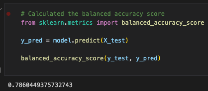

# Overview of the Analysis

This analysis focuses on predicting credit card risk. Credit risk is an inherently unbalanced classification problem, as good loans easily outnumber risky loans. Therefore, this challenge employs different techniques to train and evaluate models with unbalanced classes, using the imbalanced-learn and scikit-learn libraries to build and evaluate models using resampling.

The first part of the analysis oversamples the data using the RandomOverSampler and SMOTE algorithms, and undersample the data using the ClusterCentroids algorithm. A combinatorial approach of over-andundersampling using the SMOTEENN algorithm is also performed. Lastly, the challenge compares two new machine learning models that reduce bias, BalancedRandomForestClassifier and EasyEnsembleClassifier, to predict risk.

# Results

Using bulleted lists, describe the balanced accuracy scores and the precision and recall scores of all six machine learning models. Use screenshots of your outputs to support your results.

## Resampling Models to Predict Credit Risk

### Naive Random Oversampling

### SMOTE Oversampling

### Undersampling

### Combination (Over and Under) Sampling

## Ensemble Classifiers to Predict Credit Risk

### Balanced Random forest classifier

### Easy Ensemble AdaBoost Classifier

# Summary

Summarize the results of the machine learning models, and include a recommendation on the model to use, if any. If you do not recommend any of the models, justify your reasoning.
